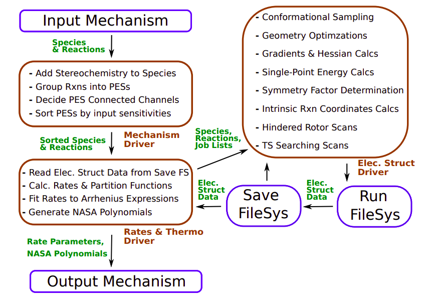

About Auto Mech
~~~~~~~~~~~~~~~

.. Some filler text to fill in later (also, this is how to put comments here).

A more detailed description of what the code does and how it runs from a user
perspective (without getting into the actual structure of the code) goes here.

Can talk about the file system storage and its advantages.

Basically, it should explain Kevin's figure below:

