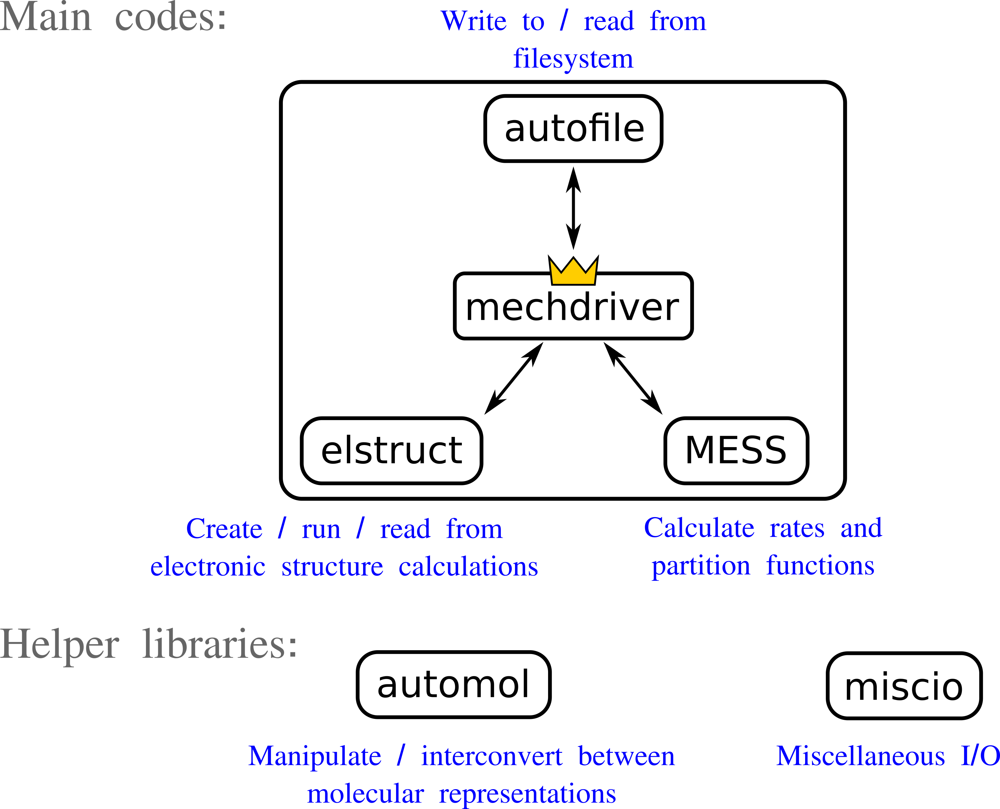

Module Documentation
====================

Overview
~~~~~~~~

.. The syntax for linking to other documentation is :doc:`text <path/to>`

The overall workflow of Auto Mech is driven by
:doc:`moldriver <./repos/moldriver/docs/a>`,
whose overarching task is to invoke electronic structure calculations through
the
:doc:`elstruct <./repos/elstruct/docs/index>`
interface and deliver the results to our master equation solver,
:doc:`MESS <./repos/MESS/docs/index>`,
for calculating partition functions and kinetic rates.

Data generated during the workflow is written to a file system database using
the
:doc:`autofile <./repos/autofile/docs/index>`
module, which also provides functions for retrieving previously stored data.

The aforementioned codes are supported by several helper libraries:

    * :doc:`automol <./repos/automol/docs/index>` provides routines for
      manipulating and interconverting between molecular descriptors (Cartesian
      geometry, z-matrix, molecular graph, InChI, SMILES, molecular formula)
    * :doc:`interfaces <./repos/interfaces/docs/index>` contains a hodge-podge
      of interaces to various programs
    * :doc:`autoparse <./repos/autoparse/docs/index>` is a low-level parsing
      library employed by the various I/O modules

Modules
~~~~~~~

.. toctree::
    :maxdepth: 1

    repos/moldriver/docs/a

    repos/autofile/docs/index
    repos/MESS/docs/index
    repos/elstruct/docs/index

    repos/automol/docs/index
    repos/autoparse/docs/index
    repos/interfaces/docs/index
