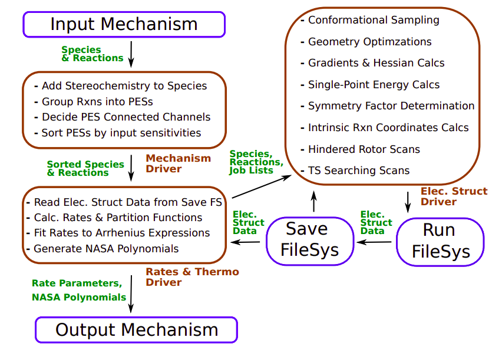

.. AutoMech documentation master file, created by
   sphinx-quickstart on Sat Jan  4 14:21:30 2020.
   You can adapt this file completely to your liking, but it should at least
   contain the root `toctree` directive.

Auto Mech
=========

What is Auto Mech?
~~~~~~~~~~~~~~~~~~

.. Some filler text to fill in later

A high-level description of the code goes here.

We can include figures as follows:

The Code Structure of Auto Mech
~~~~~~~~~~~~~~~~~~~~~~~~~~~~~~~

Key workhorses:
    * :doc:`MESS <./repos/MESS/docs/index>`: workhorse for
      kinetics/thermodynamics
    * elstruct: workhorse for electronic structure (or, rather, an interface to
      the workhorses, which are the electronic structure codes)

Driver:
    * moldriver

Libraries:
    * autofile: file system
    * automol: molecular descriptors
    * autoparse: parsing
    * interfaces: a hodge-podge of interaces to various programs

.. toctree::
    :maxdepth: 2
    :caption: Contents:

    repos/MESS/docs/index
    repos/autoparse/docs/index

Indices and tables
~~~~~~~~~~~~~~~~~~

* :ref:`genindex`
* :ref:`modindex`
* :ref:`search`
